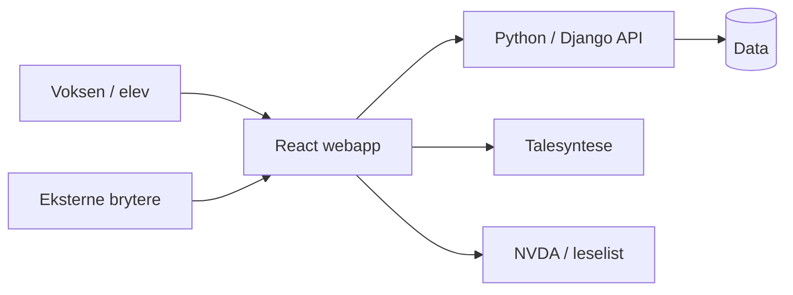

# Arkitektur

## Prototype

## Prinsipper

- React for brukergrensesnitt.
- Python/Django som foreslått backend.
- Docker som teknisk utgangspunkt.
- Bryterinput behandles som konfigurerbare tastetrykk.
- Leselist brukes gjennom skjermleser/NVDA, ikke direkte driverintegrasjon.
- Talestøtte kapsles inn slik at teknisk løsning kan byttes eller utvides.
- Produksjonsmiljø, database, medielagring og autentiseringsdetaljer er ikke låst i prototypen.
